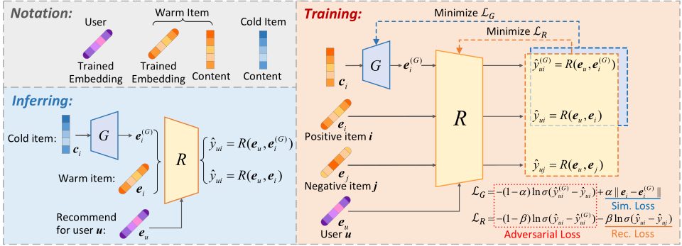

# GAR - Generative Adversarial Framework for Cold-Start Item Recommendation


# Usage
1. Prepare the tensorflow-1.15 environment. 
2. Run GAR: 
   - Go to the project directory and run *GAR-MLP* through
   
      ```python3 main.py --gpu_id 0 --dataset CiteULike --embed_meth node2vec --agg_meth none --gan_model garmlp --real_lys [200,200] --real_act tanh --sim_coe 0.1 --alpha 0.9```
      
      ```python3 main.py --gpu_id 0 --dataset XING --embed_meth node2vec --agg_meth none --gan_model garmlp --real_lys [200,200] --real_act tanh --sim_coe 0.1 --alpha 0.9```

   - For *GAR-GNN*, firstly go to the `PGE` directory and use `python3 plainagg.py --dataset name_of_dataset --emb node2vec` to construct the graph embeddings. Then go back to the project directory and run *GAR-GNN* through
   
      ```python3 main.py --gpu_id 0 --dataset CiteULike --embed_meth node2vec --gan_model gargnn --sim_coe 0.05 --alpha 0.9```
      
      ```python3 main.py --gpu_id 0 --dataset XING --embed_meth node2vec --gan_model gargnn --sim_coe 0.1 --alpha 0.9```

# Cite 
```
@inproceedings{10.1145/3477495.3531897,
	author = {Chen, Hao and Wang, Zefan and Huang, Feiran and Huang, Xiao and Xu, Yue and Lin, Yishi and He, Peng and Li, Zhoujun},
	title = {Generative Adversarial Framework for Cold-Start Item Recommendation},
	year = {2022},
	isbn = {9781450387323},
	publisher = {Association for Computing Machinery},
	address = {New York, NY, USA},
	url = {https://doi.org/10.1145/3477495.3531897},
	doi = {10.1145/3477495.3531897},
	booktitle = {Proceedings of the 45th International ACM SIGIR Conference on Research and Development in Information Retrieval},
	pages = {2565–2571},
	numpages = {7},
	keywords = {adversarial framework, cold-start recommendation, recommender system},
	location = {Madrid, Spain},
	series = {SIGIR '22}
}
```